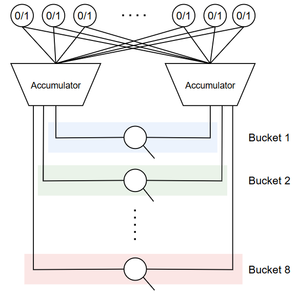

# NNUE Trainer

A repository for training NNUE (Efficiently Updatable Neural Network) for ChessEngine project.

## Methodology
This project focuses on utilizing supervised learning methods in training a NNUE model. This way of training a model is simpler to implement and less resource-intensive method than reinforcement learning, but requires big amount of appropriate data, which in this case consists of chess positions and corresponding evaluations (for example, done with another engine).

## Dataset
Data used for training and testing models come from the publicly available [lichess database](https://database.lichess.org/#evals). 
Lichess database provides milions of positions with ready engine evaluation, performed by other engines, mostly various releases of [Stockfish](https://github.com/official-stockfish/Stockfish). However, the evaluations are usually performed at a very high depth, which introduces noise into the data resulting from the influence of tactics and long, forced lines on the position. To resolve this issue, the following steps were taken:
1. Stay with lichess database position examples, but divide them into subcategories, based on number of pieces or imbalances in given position. This provides enough variety to data.
2. Perform a quiescence search type of transformation for positions where best move is either capture, check or promotion
3. Replace evaluations from lichess database with static evaluations using Stockfish

The final training set size was over 26 million elements.

## Architecture
The architecture of trained model consists of following elements:
- Input layer with **768** neurons - each neuron represents a possible combination of piece color, piece type and square and contains logical 0 (when no piece of given color and type is present on given square) or 1 (the opposite situation)
- Hidden layer with **2 * 1024 neurons** - hidden layer consists of two *accumulators* - one for side to move, and the other for other side. Each of them contains 1024 neurons and has the same weights and biases.
- **8** separate output layers (output buckets) - each of them with **1** neuron and separate weights and biases. Each output bucket represents given stage of the game, and the choice of which to use depends on number of non-king pieces on the board
- **CReLU (Clipped ReLU)** activation function - or, to be precise, ReLU6 activation function, which is essentially a variant of CReLU  

## Results
Not ready yet, will be added after ChessEngine project gets finished.

## Future improvements
This project uses the most basic methods, which are possible to implement in the context of hardware limitations. It is essentially the equivalent of "Hello World" in the field of applying neural networks to chess. For this reason, the range of potential improvements and directions for development is wide and includes, among others:
- Increasing the amount of training data (to billions of positions instead of millions)
- Experimenting with network architecture - for exmple, by adding more hidden layers
- Applying more advanced NNUE techniques such as king buckets (see [this](https://www.chessprogramming.org/NNUE))
- Applying reinforcement learning methods
